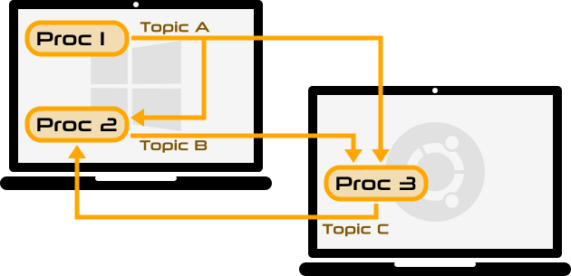
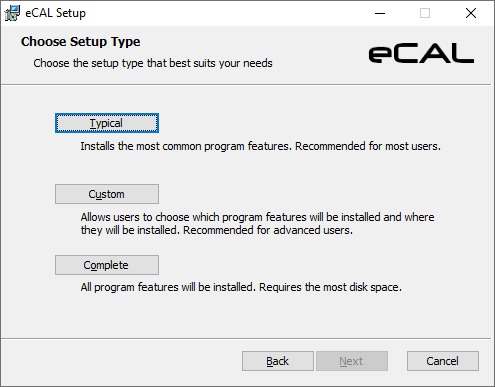
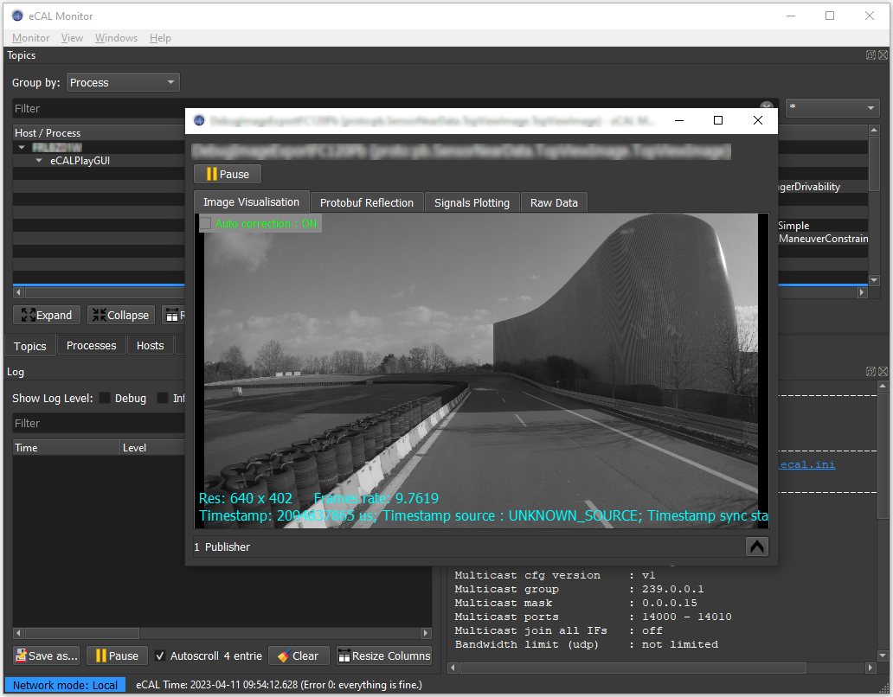

# eCAL - enhanced Communication Abstraction Layer


[](https://github.com/continental/ecal/actions?workflow=Build+Windows+Server+2019) [](https://github.com/continental/ecal/actions?workflow=Build+Ubuntu+18.04) [](https://github.com/continental/ecal/actions?workflow=Build+Ubuntu+20.04) [/badge.svg)](https://github.com/continental/ecal/actions?workflow=Build+Ubuntu+20.04+(Iceoryx)) [](https://github.com/continental/ecal/actions/workflows/build-macos.yml)

[](LICENSE.txt)

The **e**nhanced **C**ommunication **A**bstraction **L**ayer (eCAL) is a middleware that enables scalable, high performance interprocess communication on a single computer node or between different nodes in a computer network.
eCAL uses a **publish - subscribe** pattern to automatically connect different nodes in the network.

eCAL automatically chooses the best available data transport mechanism for each link:
- **Shared memory** for local communication _(incredible fast!)_
- **UDP** for network communication

Visit the eCAL Documentation at 🌐 http://ecal.io for more information.



## Facts about eCAL

* eCAL is fast (1 - 10 GB/s, depends on payload size. Check the measured performance [here](https://continental.github.io/ecal/advanced/performance.html))
* eCAL provides both publish-subscribe and server-client patterns
* eCAL is brokerless
* eCAL provides a C++ and C interface for easy integration into other languages (like python, csharp or [rust](https://github.com/kopernikusai/ecal-rs))
* eCAL can be used in conjunction with Matlab Simulink as [eCAL Simulink Toolbox](https://de.mathworks.com/matlabcentral/fileexchange/92825-ecal-toolbox) for simulation and prototyping
* eCAL has powerful tools for [recording](https://continental.github.io/ecal/getting_started/recorder.html), [replay](https://continental.github.io/ecal/getting_started/player.html) and [monitoring](https://continental.github.io/ecal/getting_started/monitor.html) all your data flows - decentralized
* eCAL is simple and zero-conf. No complex configuration for communication details and QOS settings are needed
* eCAL is message protocol agnostic. You choose the message protocol that fits to your needs like [Google Protobuf](https://developers.google.com/protocol-buffers), [CapnProto](https://capnproto.org/), [Flatbuffers](https://google.github.io/flatbuffers/)...
* eCAL uses the standardized recording format [HDF5](https://www.hdfgroup.org/solutions/hdf5/)
* eCAL integrates gently into your ROS2 environment with the [eCAL RMW](https://github.com/continental/rmw_ecal)  
* eCAL supports Intel and arm platforms

* eCAL runs on a wide variety of operating systems:
  * Windows (stable)
  * Linux (stable)
  * QNX (stable)
  * MacOS (experimental)
  * FreeBSD (experimental)

## Installation

We provide binary installers for Windows and Ubuntu. If you need further help installing and configuring eCAL, please refer to the [documentation](https://continental.github.io/ecal/getting_started/setup.html).

### Windows

[Download](https://continental.github.io/ecal/_download_archive/download_archive.html) the latest eCAL Installer and follow the Setup Wizard


    
*We only support 64bit Windows 7 / 10*

### Ubuntu

Install eCAL from our PPA:

```bash
sudo add-apt-repository ppa:ecal/ecal-latest
sudo apt-get update
sudo apt-get install ecal
```
This PPA will always upgrade you to the latest eCAL Release (-> Rolling Release PPA). If you intend to stay on an specific release, check out other PPAs [here](https://continental.github.io/ecal/getting_started/setup.html#fa-ubuntu-automatically-install-ecal-from-a-ppa).

*Ubuntu 16.04, 18.04, 20.04, 20.10, 21.04 for CPU architectures i386, x64, armhf, arm64 are supported at the time of writing.*

## Example

Using eCAL in your project to exchange data is simple. After you have [downloaded eCAL](http://ecal.io) and installed CMake, you are good to go.

Check out the [Hello World](https://continental.github.io/ecal/getting_started/hello_world.html) example from the eCAL documentation for further details.

``` cpp
#include <ecal/ecal.h>
#include <ecal/msg/string/publisher.h>

#include <thread>

int main(int argc, char** argv)
{
  // Initialize eCAL. The name of our process will be "Hello World Publisher"
  eCAL::Initialize(argc, argv, "Hello World Publisher");

  // Create a String Publisher that publishes on the topic "hello_world_topic"
  eCAL::string::CPublisher<std::string> publisher("hello_world_topic");

  // Infinite loop
  while (eCAL::Ok())
  {
    // Publish a "Hello World" message
    publisher.Send("Hello World");

    std::this_thread::sleep_for(std::chrono::milliseconds(500));
  }

  // finalize eCAL API
  eCAL::Finalize();
}
```

## Tools from the eCAL ecosystem

eCAL comes with a set of read-to-use tools that will help you with developing, testing and debugging your software. **Command line interface** versions and easy to use **GUI** applications are available.

- The **eCAL Monitor** to visualize the data flow and inspect messages sent between publishers and subscribers 

- The **eCAL Recorder** to record the data sent between your eCAL nodes

- The **eCAL Player** to replay the eCAL recordings later on

- **eCAL Sys** to define your system configuration and monitor your applications



## Projects using eCAL
* [trellis](https://github.com/agtonomy/trellis) - General purpose middleware framework for distributed applications
* [ecal-toolbox](https://github.com/mathworks/ecal-toolbox) - Mathworks simulink toolbox for eCAL
* [golang-ecal](https://github.com/Blutkoete/golang-ecal) - eCAL go language binding
* [ecal-rs](https://github.com/kopernikusai/ecal-rs) - eCAL rust language binding
* [rmw_ecal](https://github.com/continental/rmw_ecal) - eCAL / ROS2 middleware layer
* [gpsd2ecal](https://github.com/continental/gpsd2ecal) - eCAL gps gateway
* [ecal_mongraph](https://github.com/ecal-io/ecal_mongraph) - Simple graph visualization for eCAL
* [ecal2ros](https://github.com/ecal-io/ecal2ros) - Demo gateway eCAL5 to ROS2
* [ros2ecal](https://github.com/ecal-io/ros2ecal) - Demo gateway ROS2 to eCAL5

## Projects used by eCAL
* [fine-ftpserver](https://github.com/continental/fineftp-server) - FTP functionality to collect distributed measurement artifacts over network
* [tcp_pubsub](https://github.com/continental/tcp_pubsub) - Additional TCP transport layer for higher reliability for publication/subscription over network
* [iceoryx](https://github.com/eclipse/iceoryx) - Alternative shared memory transport layer (needs to be activated via CMake options)
* [docker-ecal](https://github.com/Blutkoete/docker-ecal) - Inoffical dockerfiles for eCAL

## License

eCAL is licensed under Apache License 2.0. You are free to

- Use eCAL commercially
- Modify eCAL
- Distribute eCAL

eCAL is provided on an “as is” basis without warranties or conditions of any kind.
