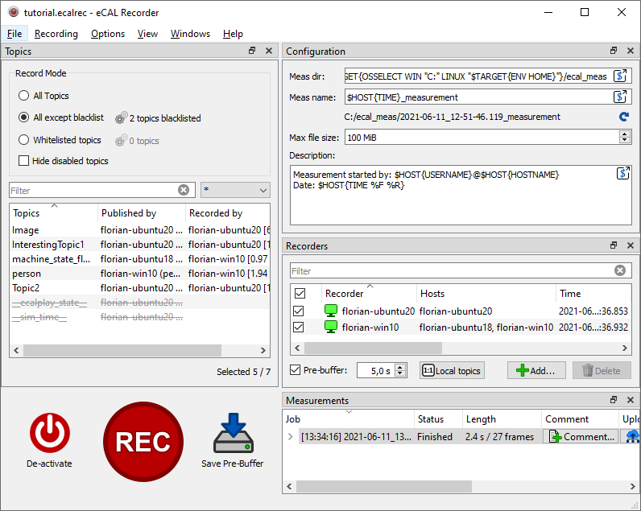

.. include:: /include.txt
.. include:: /_include_ecalicons.txt

.. _applications_recorder_gui:

==================================
|ecalrec_APP_ICON_h1| eCAL Rec GUI
==================================

The recorder GUI is the most user friendly application to start recordings and to create :file:`.ecalrec` configuration files.
So let's walk through it to explain all the feature it has.

Main Control Panel
------------------

- |ecalicons_POWER_ON| :guilabel:`Activate` / |ecalicons_POWER_OFF| :guilabel:`Deactivate`:
  Clicking this button will Activate and Deactivate eCAL Rec.
  For just starting a recording, it is not mandatory to do that manually.

  However, if you have a pre-buffer configured, activating the recorder actually is important.
  Activating will make the recorder create eCAL Subscribers and start buffering data.
  So if you don't click activate, your pre-buffer will not get filled.

- |ecalicons_RECORD| :guilabel:`Rec` / |ecalicons_STOP| :guilabel:`Stop`:
  Starts or stop a recording.

- |ecalicons_SAVE_TO_DISK| :guilabel:`Save Pre-Buffer`: Save the content of the pre-buffer to its own measurment.

  This button is only enabled, when you have enabled pre-buffering *and* the recorders are activated.
  Basically, this is a shortcut for quickly clicking Rec + Stop.
  However you can even save the pre-buffer while a recording is running.
  It will not interfere with that.

Topics
------

The topics panel on the upper left side has multiple functions:

- It displays all eCAL that are recorded or can be recorded
- It lets you create a black- or whitelist 
- During a recording it shows which topic is recorded by which recorder
  
Note that in a distributed recording environment, the blacklist / whitelist setting is used for all clients.
Having different settins for individual clients is not possible.

.. tip::
    You can either manage your blacklist / whitelist by clicking the gear icon |ecalicons_SETTINGS| or by right-clicking a topic from the list.

Configuration
-------------

The configuration panel lets you configure your global measurement settings.
These settings are used for all new recordings.

- **Meas dir**: The measurement root direcotry.
  The recorder will create a directory for individual measurements inside this directory.

  If you are using different operating systems, you have to make sure the path works for all clients.
  Click the |qecalparser_SHOW_DIALOG| button to open an improved editor to help you with the replacement syntax.

  The default is:
  
  - |fa-windows| Windows: :file:`C:/ecal_meas/`
  - |fa-Ubuntu| Ubuntu: :file:`~/ecal_meas/`

- **Meas name**: The name of the directory that is created inside the measurement root directory.

  .. important::

     You should **always** include a **timestamp** in your measurement name.
     Otherwise multiple measurements will end up in the same directory and may overwrite each other.

- **Max file size**: The maximum file size of the :file:`.hdf5` files that will be created.
  If the maximum file size is reached, the measurement will be splitted to multiple files.

- **Description**: A general purpose measurement description.
  It will be saved to the :file:`doc/description.txt` file inside each measurement.

Recorders
=========
  
