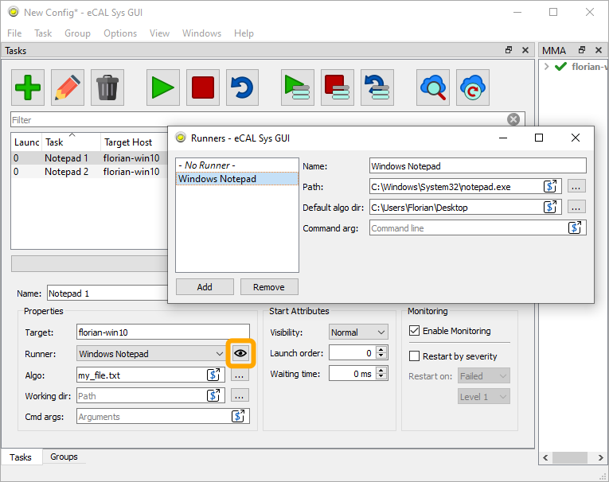
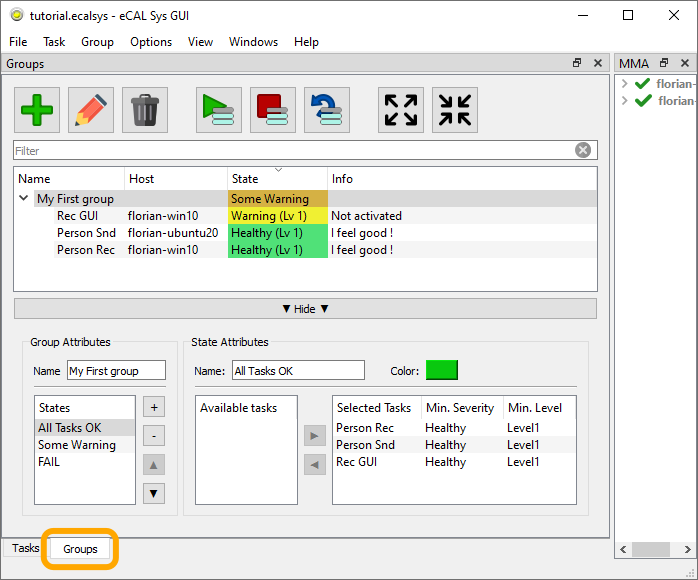
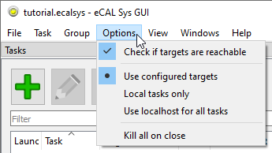

.. include:: /include.txt
.. include:: /_include_ecalicons.txt

.. _applications_sys_overview:

=======================================
|ecalsys_APP_ICON_h1| eCAL Sys Overview
=======================================

In this chapter we will take a deeper look at eCAl Sys.
We will discuss the Host / Client architecture and look at all available configuration options and functions in the GUI.

.. seealso::

   If you are new to eCAL Sys, please first check out the :ref:`Getting Started with eCAL Sys <getting_started_sys>` chapter.
   That chapter will teach you the very basics of eCAL Sys.

   If you don't want to use the GUI, please see the :ref:`applications_sys_cli` chapter.

Architecture
============

eCAL Sys consists of 2 (or 3) applications:

#. The **Host Application**.
   This can be either one of:

   - eCAL Sys GUI (:file:`ecal_sys_gui /.exe`)
   - eCAL Sys CLI (:file:`ecal_sys /.exe`)

   The Host Application is started only once on the machine that is supposed to control everything else.
   This application is responsible for loading the configuration file and keeping track of all task states.

#. The **Client Application** (:file:`ecal_sys_client /.exe`). 

   The Client Application is started on all machines that shall be remote-controlled.
   It creates an eCAL Service and gets remote-controlled by the eCAL Sys Host Application.

   The eCAL Sys Client is not needed on the machine, where the Host Application is running.

   .. note::

      The eCAL Sys Client is a remote control application with not authentication.
      If you are annoyed by accepting this security implication at startup, you can start eCAL Sys Client with:

      .. code-block:: console

         ecal_sys_client --auto-accept-security-risk

#. The **Machine Monitoring Application** (:file:`ecal_mma /.exe`). 

   This application is not required for eCAL Sys itself.
   However, eCAL Sys will display information about system resources of all systems that run an ecal_mma:

   .. image:: img/ecal_sys_mma.png
      :alt: eCAL Sys MMA
      :align: center

   .. tip::

      You can use eCAL Sys to start the MMA Application, by creating an ``ecal_mma`` task.

Configuration Files
===================

eCAL Sys saves configuration files with the ``.ecalsys`` extension.
Those files contain a regular XML description of the configuration.
Although you could write .ecalsys files by hand, it is much easier to use eCAL Sys GUI for that.
The command line application (eCAL Sys CLI) can only load .ecalsys files, but not write them.

.. tip::
   
   You can write your paths and command line arguments in a generic way and e.g. use environment variables or do different things based on the host or target operating system.
   eCAL provides a replacement syntax for that and displays an icon where you can use it.

   For instance to use an environment variable ``my_root_dir`` that you have configured differently on each target, use:

   .. code-block::
   
      $TARGET{ENV my_root_dir}/task

   Click one of the |qecalparser_SHOW_DIALOG| :guilabel:`Advanced Editor...` buttons for further information.

eCAL Sys GUI
============

In most cases, the eCAL Sys GUI will be your primary application.
It can both create .ecalsys files and start, stop and monitor your tasks.

So let's look at all of the things you can do with eCAL Sys GUI.

.. image:: img/ecal_sys_task_overview.png
   :alt: eCAL Sys Task Overview

Toolbar
-------

- |ecalicons_ADD| :guilabel:`Add`:
  Add a new task

- |ecalicons_EDIT| :guilabel:`Edit`:
  Open the edit panel to edit the selected Tasks

- |ecalicons_DELETE| :guilabel:`Delete`:
  Delete the selected tasks

- |ecalicons_START| :guilabel:`Start` / |ecalicons_STOP| :guilabel:`Stop` / |ecalicons_RESTART| :guilabel:`Restart`:
  Start, stop or restart all of your tasks.
  A task that already been started will not be started again.
  If you want a task to run multiple times, you have to duplicate it.

  If you only want to start some of your tasks, use the according buttons: |ecalicons_START_SELECTED| / |ecalicons_STOP_SELECTED| / |ecalicons_RESTART_SELECTED|

- |ecalicons_IMPORT_FROM_CLOUD| :guilabel:`Import from cloud...`:
  This is a function to help you with creating your eCAL Sys configuration.
  Instead of typing all tasks manually in eCAL Sys, you can also  start you tasks manually on all of your machines and then click this button.
  You can then select all tasks that you want to appear in your eCAL Sys configuration and import them to replicate the configuration later.

  .. image:: img/ecal_sys_import_from_cloud.png
     :alt: eCAL Sys - Import from cloud

- |ecalicons_UPDATE_FROM_CLOUD| :guilabel:`Update from cloud`:
  This function tries to match eCAL Processes that are already running to your loaded configuration.
  Use this function, if you e.g. have closed eCAL Sys GUI by accident, as this will cause you to loose the information which tasks have already been started and which PID belongs to them.

  Note that Update from cloud needs a running eCAL Sys Client on all remote machines.

Task configuration
------------------

- **Name**:
  The task name that you can choose freely.
  It is used for displaying in the GUI.
  When using eCAL Sys CLI or controlling eCAL Sys with the eCAL Service, you can also use this name to start / stop / restart tasks by name.

- **Properties**:

  - **Target**:
    The hostname where the tasks shall be started.

  - **Runner**:
    The runner that shall be used for the task.
    Please see the :ref:`Runner Section<applications_sys_runner>` below.

  - **Algo**:
    The command you want to have executed on the target.
    Usually this is a path to an executable.

  - **Working dir**:
    If given, the task will be started in this working directory.

  - **Cmd args**:
    Additional arguments that thall be appended to the command line when starting the task

- **Start Attributes**:

  - **Visibility**:
    Whether the window of the started task shall be normal, maximized or minimized.
    Only supported on Microsoft Windows.

    When using a terminal emulator on linux (see :ref:`ecal.ini<ecalini_option_terminal_emulator>`), the option *minimized* will prevent opening a terminal emulator and the process will print its output in the ecal_sys_client terminal as usual.
    
  - **Launch order**:
    Defines the order of tasks that must be started serialized.
    Tasks with a lower launch order are started first.
    Tasks that share the same launch order may be started in parallel, there are no guarantees about the order.    

  - **Waiting time**:
    How many milliseconds eCAL Sys has to wait after starting the task.
    Use this if one of your task needs some time for startup and you don't want other tasks being started during that period.
    
    Be aware that other tasks sharing the same launch order are still started in parallel.
    eCAL Sys will shedule the timout after all tasks with the current launch order number have been started.

- **Monitoring**:

  - **Enable Monitoring**:
    Untick this option to prevent eCAL Sys from displaying the monitoring information.

  - **Restart by severity**:
    Use this option if you want your task to be automatically restarted once it reports an error.
    The task will be killed by means of the operating system.

    If you ever tend to use this option, you should consider writing better tasks.
    It is usually advisable to make the task handle it's own error and not kill and restart it.

.. _applications_sys_runner:

Runners
-------

A runner is an executable that you want to execute multiple times with different parameters.
Often a runner will load a file, e.g. a .dll file that it will then execute, but it can just as well only receive command line arguments that modify its behaviour.

To manage the runners, you can click :guilabel:`View / Runners` or click the |ecalicons_EYE| icon.

.. note::
   You can do anything a runner can do with just plain tasks.
   The runners are only there to help you not typing the same path over and over again.

- **Name**:
  The name of your runner.
  This name will be displayed in the combobox in the task editor.

- **Path**:
  The path to your runner's executable.

- **Default algo dir**:
  The directory where you want the runner to look for the (algo-) file you provide.
  
  Note that this is not the working directory, from which the runner is started!
  If your runner has a default algo dir configured and you enter an algo that is detected to be a relative path, this path will be interpreted to be relative to your default algo path.

- **Command arg**:
  The command that shall be used to load your algo.
  If empty, the algo will simply be appended on the command line.

The example screenshot shows a Windows Notepad Runner, that will look for the files on my Desktop.
There is no Runner command argument.
The given algo (``my_file.txt``) is a relative path, so eCAL Sys will use the default algo dir.
The resulting command line for the selected task (Notepad 1) will be:

.. code-block::

   C:\Windows\System32\notepad.exe "C:\Users\Florian\Desktop\my_file.txt"

Groups
------

You can create groups of tasks in eCAL Sys to calculate an "overall state".
The groups panel can be reached from the lower tab bar.

As explanation, we will use the ``tutorial.ecalsys`` file from the :ref:`Getting Started with eCAL Sys<getting_started_sys_files>` chapter.
A group can be created by clicking the |ecalicons_ADD| :guilabel:`Add` button.

.. tip::
   
   Download the file and check out how those groups are configured!

- **Group Attributes**:
  
  - **Name**:
    The name of your group.
    This name will be used in the group list.

  - **States**:
    Create states by clicking the :guilabel:`+` button.
    eCAL Sys will evaluate your states from top to bottom.
    The first state that meets all its requirements becomes active.
    The active state will be displayed in the group list ("Some Warning" in the screenshot).

    If no state meets its requirements, no state will be active.

- **State Attributes**:

  - **Name**:
    The name of your state, that will be displayed when the state is avtive.

  - **Color**:
    The color that your state shall appear in, when being active.

  - **Available tasks**:
    A list of all tasks that you have configured.
    Use the :guilabel:`▶` button to move a task to the Selected Tasks list.

  - **Selected Tasks**:
    The list of tasks that are important for the current state.
    Here you have to set the minimum serverity for all tasks in the state.
    The state becomes active, when all tasks report a servery that is *at least* as good as the minimum severity you have configured.

.. tip::
   
   Usually, you want to have an empty state indicating a failure at the end of your state list.
   If no other state is active, this one will always be, as it doesn't have any requirements.

   In the ``tutorial.ecalsys`` file the "FAIL" state is used for that purpose.
   It has an empty "Selected Tasks" list.

Options
-------

This section is about the :guilabel:`Options` available from the menubar:

- **Check if targets are reachable**:
  When checked, eCAL Sys will check whether there is a running *eCAL Sys Client* on all target machines (except on the current machine, it doesn't need one there).
  When one of the clients is missing, it will prompt a warning.

- **Target overrides**:
  These are "permanent" target overrides, i.e. the options are saved in the .ecalsys file.

  - **Use configured targets**:
    Start tasks on the host you set as target.

  - **Local tasks only**:
    Only start tasks that would have been started on the current machine, anyways.
    Tasks that would have been started remotely are omitted.
  
  - **Use localhost for all tasks**:
    Treat all tasks as if you would have configured them to start on the current machine.

  .. tip::
    
     Instead of using these target overrides, you can also temporarily override the target from the context menu!

     .. image:: img/ecal_sys_start_on_host.png
        :alt: eCAL Sys - Start on Host

- **Kill all on close**:
  Forcefully shut down all tasks when you close eCAL Sys GUI.