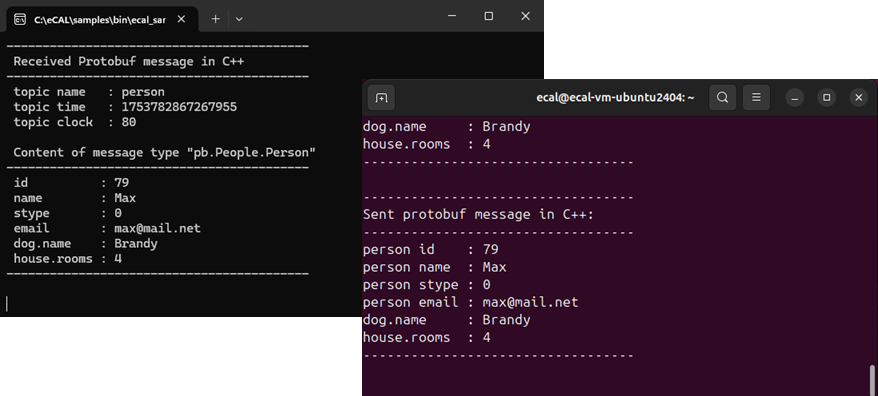

.. include:: /include.txt

.. _getting_started_cloud:

=====================
Network configuration
=====================

.. hint::
   If you don't have two PCs at your hand or if you are just not interested in inter-machine-communication, just skip this topic.
   It is not essential for the next tutorials to use cloud communication.

   Of course, you can use a virtual machine (e.g. with VMWare or VirtualBox) as second PC.
   Just add a host-only adapter to your VM.

Quite often you want data to flow between eCAL nodes on different machines.
eCAL can run in two modes, that differ from each other: **local mode** and **cloud mode**.

.. _getting_started_cloud_local_mode_vs_cloud_mode:

.. list-table:: Local mode vs. cloud mode
   :widths: 50 50
   :header-rows: 1

   * - Local mode
     - Cloud mode
   * - * Uses localhost (127.0.0.1) for registration (-> e.g. telling others about new topics and subscribing to topics)
     - * Uses Multicast (239.0.0.1) for registration
   * - * Uses shared memory to send actual data to other processes
     - * Uses UDP multicast (239.0.0.x) to send data to other hosts
       * Uses shared memory to send data to processes on the same host

Enable network-mode in :file:`ecal.yaml`
=======================================

.. note:: 

   Up to eCAL 5.9, eCAL shipped with a cloud-mode-configuration by default.
   This changed with eCAL 5.10.

   So since eCAL 5.10 you will have to enable network-mode first.

By default, eCAL is configured in local mode.
To switch eCAL to cloud mode, edit your :file:`ecal.yaml` and change the following settings:

* |fa-windows| Windows: |ecalini-path-windows|
* |fa-ubuntu| Ubuntu: |ecalini-path-ubuntu|

.. code-block:: yaml

   # Registration layer configuration
  registration:
    [..]
    # true  = all eCAL components communicate over network boundaries
    # false = local host only communication (Default: false)
    network_enabled: true
    [..]

  # Transport layer configuration
  transport_layer:
    udp:
      [..]

      network:
        [..] 
        # TTL (hop limit) is used to determine the amount of routers being traversed towards the destination
        ttl: 2   

The ``transport_layer->udp->network->ttl`` setting configures the *time to live* of the UDP datagrams, i.e. the number of hops a datagram can take before it is discarded.
Usually, ``2`` is sufficient, but if you have a network with many routers, you may have to increase that number.

.. seealso::

   Also see the advanced section to learn about changing between :ref:`local mode <configuration_local>` and :ref:`cloud mode <configuration_cloud>`!

Multicast route configuration
=============================

Now that you have set eCAL to cloud mode, it will already start sending out UDP Multicast packages for detecting other eCAL Nodes.
Your Operating System however has to send those Multicast packages to a proper network interface controller (NIC).
This is not trivial, as the destination IP ``239.0.0.1`` does not "really" exist.

Therefore you have to create a **route**, i.e. a ``239.0.0.x -> outgoing NIC`` mapping.

.. _getting_started_cloud_configuration_on_windows:

|fa-windows| Multicast configuration on Windows
-----------------------------------------------

#. Check the IPv4 address of the ethernet adapter you are using to connect your two PCs.
   You can do that by typing ``ipconfig`` in a command prompt.
   You will need the IP of your *current* machine you are setting the route on.
   
#. Open a command prompt with **administrator** privileges

#. Enter the following line and replace xx.xx.xx.xx with your IP address
   
   .. code-block:: bat

      route -p add 239.0.0.0 mask 255.255.255.0 xx.xx.xx.xx

   .. tip::
      
      If you made a mistake, you can delete your route/s with ``route delete 239.0.0.0``.
      Your eCAL communication may not work, if you leave faulty routes in place.

#. Reboot
#. Check the result from a command prompt.
   It should show your route under `IPv4 Route Table / Persistent Routes`.
   
   .. code-block:: bat

      route print

   .. image:: img/win_route_print.png
      :alt: Windows route print

.. tip::
   It is recommended to assign a static IP, so your multicast route will not become outdated at some point.

.. _getting_started_cloud_ubuntu_routes:

|fa-ubuntu| Multicast configuration on Ubuntu
---------------------------------------------

You can configure the multicast route in various ways, depending on your Ubuntu version.

Jump to your section of choice below:

#. Choose how to create routes:

   - **Via netplan** (Recommended for Ubuntu 18 and up. Even integrates into the GUI.)
   - **Via GUI** (Works well for desktop Ubuntu)
   - **Via /etc/network/interfaces** (Legacy, up to Ubuntu 18. Not supported in Ubuntu 20, any more.)

#. :ref:`Test the configuration<ubuntu_multicast_route_test>`

.. tabs::

   .. tab:: Netplan (recommended)

      Netplan is used since Ubuntu 18 and should be used in favor of the legacy (but well known) :file:`/etc/network/interfaces` file.
      While Ubuntu 18 supports both out of the box, for Ubuntu 20 this is the only file-based networking configuration method.

      .. tip::

         Netplan uses YAML files for configuration.
         YAML uses spaces (``' '``) as indentation and does not work with tabs (``'\t'``).
         When using gedit, it is recommended to configure it to use spaces instead of tabs.

         .. figure:: img/gedit_space_indentation.png
            :alt: Space indentation in gedit
            :align: center

      #. Configure the **loopback multicast** route (this will become active, if you disconnect from all networks).

         .. code-block:: bash

            sudo gedit /etc/netplan/50-ecal-multicast-loopback.yaml

         Paste the following configuration:

         .. literalinclude:: netplan/50-ecal-multicast-loopback.yaml
            :language: yaml

      #. Configure the **external multicast** route.
         This will get a lower metric and will thus become the preferred route once the interface is up.

         .. code-block:: bash

            sudo gedit /etc/netplan/50-ecal-multicast.yaml

         Paste the following configuration and **replace eth0** with your desired interface:

         .. literalinclude:: netplan/50-ecal-multicast.yaml
            :language: yaml

      #. Apply the changes

         .. code-block:: bash

            sudo netplan apply

         .. important::

            In Ubuntu 20.04 and up you may also have to *activate* the netplan setting in the network configuration GUI!

            .. figure:: img/gnome_netplan_gui.svg
               :alt: Activate the netplan settings from the Gnome GUI
               :align: center

   .. tab:: GUI (easiest)

      If you have a graphical network manager installed (-> Desktop Ubuntu), you can use it to configure the external route.

      .. important::

         This method lacks the ability to configure a loopback route. 
         When you are not connected to any network, your eCAL communication will fail.
         You can however combine this method with the loopback configuration from netplan.

      #. Configure the **external multicast** route

         - System Settings -> Network -> Your Adapter -> Options -> IPv4 Tab -> Routes

         - Create a route:

         - Address: :code:`239.0.0.0`
         - Netmask: :code:`255.255.255.0`
         - Gateway: :code:`0.0.0.0`
         - Metric: :code:`1`

         .. image:: img/ubuntu_route_gui.png
            :alt: Ubuntu multicast route

      #. Turn the interface off and on again

      #. Configure the **loopback multicast** route via *netplan* or :file:`/etc/network/interfaces`.
         You can omit this, but then you will have to explicitly set eCAL to local mode, if you are not connected to any network.
 
   .. tab:: etc/network/interfaces (legacy)

      The well known :file:`/etc/network/interfaces` file is supported up to Ubuntu 18.
      It is not supported since Ubuntu 20, anymore.
      Please use netplan instead.
      If you are running Ubuntu 18, using netplan is still recommended, unless you want to manage other interfaces via :file:`/etc/network/interfaces`.

      Edit the file and add the content below.

      .. code-block:: bash

         sudo gedit /etc/network/interfaces

      #. Configure the **loopback multicast** route (this will become active, if you disconnect from all networks).

         Add the following lines beneath the :code:`iface lo inet loopback` line:

         .. code-block:: bash

            post-up ifconfig lo multicast
            post-up route add -net 239.0.0.0 netmask 255.255.255.0 dev lo metric 1000

      #. Configure the **external multicast** route.
         This will get a lower metric and will thus become the preferred route once the interface is up.

         Add the following lines and **replace eth0** with your interface.
         You may want to replace the dhcp line with your desired configuration.

         .. code-block:: bash

            # replace eth0 with your network adapter
            auto eth0
            allow-hotplug eth0
            iface eth0 inet dhcp
            post-up ifconfig eth0 multicast
            post-up route add -net 239.0.0.0 netmask 255.255.255.0 dev eth0 metric 1

      #. Restart your PC

.. _ubuntu_multicast_route_test:

Test the configuration
''''''''''''''''''''''

Check the result from a terminal. It should show routes for local and external communication:

.. code-block:: bash
   
   route -n

.. image:: img/ubuntu_route_print.png
   :alt: Ubuntu route -n

eCAL Samples over network
=========================

Now start one :file:`ecal_sample_person_snd` and one :file:`ecal_sample_person_rec`, just as in the :ref:`previous section<getting_started_samples>`.
But on different machines!
If you configured everything correctly, publisher and subscriber should connect almost immediately and exchange data.

