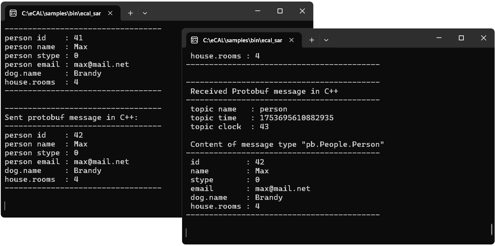

.. include:: /include.txt

.. _getting_started_samples:

=====================================
eCAL Samples
=====================================

The eCAL installation comes with a set of ready-to-use sample applications. So, let's start one of those to see some eCAL communication! 

.. note::
   For now, you should start everything on the same PC.
   We will cover communication between multiple PCs in the next section.

Basic communication
===================

.. _getting_started_disable_firewall:

.. important::
   eCAL exchanges data over IP multicast.
   If you are using some third-party firewall, you may have to turn that off.

   .. image:: img/disable_mcaffee_firewall.png
      :alt: Disable McAffee Firewall

The sample we are going to use to try out the "normal" eCAL communication is `ecal_sample_person_snd`. Start it!

* |fa-windows| On Windows start |person_send-path-windows|
* |fa-ubuntu| On Ubuntu call :file:`ecal_sample_person_snd` from a terminal (it should be in your PATH)

You now have a console-based application that periodically prints some text to the terminal. In the background the application created a topic `person` and sends data to it. So, let's add a subscriber that receives the data!

* |fa-windows| On Windows start :file:|person_receive-path-windows|
* |fa-ubuntu| On Ubuntu call :file:`ecal_sample_person_rec` from a terminal

Congratulations! You are looking at your first local eCAL communication! The subscriber subscribed to the topic `person` and prints all data it receives to the terminal.

.. tip::
   Start a second publisher and a second subscriber to see what happens! Both publishers will send their data to the same topic, so all subscribers will receive the data of all publishers.
