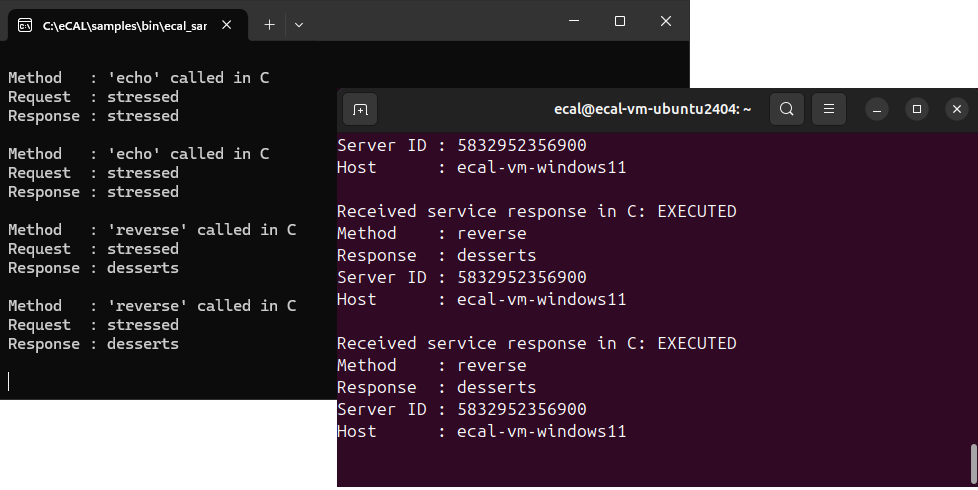

.. include:: /include.txt

.. _getting_started_services:

=============
eCAL Services
=============

Normal eCAL communication creates a one-way data flow only, i.e. the data is sent from the publisher to one (or multiple) subscriber/s.
eCAL Services in contrast always have a request and a response, so data must flow in both directions.
Internally they also work differently to be more reliable.
They are used by many eCAL applications for providing an external API.

Local service samples
=====================

Let's start a sample that creates and calls a service!

* |fa-windows| On Windows start:

  * |service_server_c-path-windows|
  * and |service_client_c-pathwindows|

* |fa-ubuntu| On Ubuntu start:

  * :file:`ecal_sample_service_server_c`
  * and :file:`ecal_sample_service_client_c`

.. note::
   Right after you started the client, it may print a few errors about the service not being found.
   Available eCAL services are propagated every 500ms, so it will always take a short amount of time until a service is known to exist.

.. _getting_started_services_cloud:

Hostname resolution
===================

Of course, eCAL services also work over network as seamlessly as the normal eCAL communication.

To make services reliable, eCAL uses TCP for them (in contrast to UDP that is used for normal eCAL traffic to increase the performance).
To obtain the destination for the TCP stream, the Hostname of the machine offering the service is used.
Thus, eCAL relies on the operating system being able to resolve the host name to an IP address.

In a pure-Windows network, the operating systems are usually able to resolve the host names out of the box.
For Linux devices that might not be the case.

To check whether the IP address of a given hostname within the network can be resolved, try to ping the device by its name:

.. code-block:: batch

   ping my-host-1

If the ping fails, the OS may not be able to derive the machine’s IP address. In that case, the hostname-IP mapping must be added to the hosts file.

The hosts file maps a hostname to an IP address.
Please edit it and add one line for each host (replace the XX.XX.XX.XX with the IP address of the host following it):

- |fa-windows| Windows: ``C:\Windows\System32\drivers\etc\hosts``
- |fa-ubuntu| Ubuntu: ``/etc/hosts``

.. code-block:: none

   XX.XX.XX.XX my-host-1
   XX.XX.XX.XX my-host-2

After the setup, please verify that all of your machines can ping each other.

.. tip::
   
   |fa-windows| To easily edit the hosts file on Windows, press :kbd:`Win` + :kbd:`R`, enter
   
   ``notepad.exe C:\Windows\System32\drivers\etc\hosts``
   
   and then press :kbd:`Ctrl` + :kbd:`Shift` + :kbd:`Enter` to open the file as administrator.

Service Sample over network
===========================

Now start one :file:`ecal_sample_service_server_c` and one :file:`ecal_sample_service_client_c`, just as above.
But on different machines!
If you configured everything correctly, the client will now call the service on a different machine.

